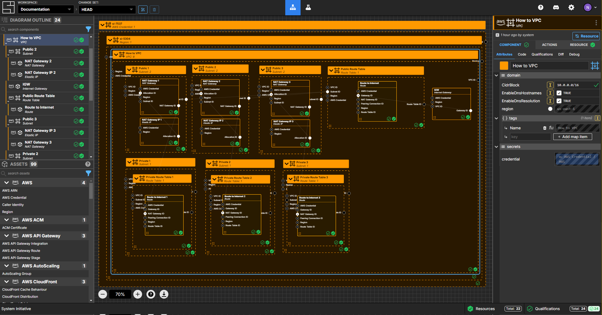

# UX Designer II Take Home Assessment

This document outlines the UX Designer II take-home assessment for System Initiative. It is designed to verify:

* Your proficiency with high-fidelity prototyping and user flow creation
* Your ability to conceptualize and design features that enhance collaboration
* Your capacity to make thoughtful design decisions and clearly articulate their value

We use a take-home assessment to allow you to work in your most productive environment. Feel free to use any tools, resources, or references that you need. We recommend spending no more than 4 hours on this assessment. While the scope of this exercise may exceed the time allotted, we aim to understand how you prioritize and break down complex problems into manageable deliverables.

## What you will be building

At System Initiative, we work using [opportunities](https://docs.systeminit.com/explanation/working-on-si) so we wanted to break down the problem using an opportunity canvas

## Deliverables

1. Wireframes that clearly illustrate how a user would engage with the feature from start to finish.
  
2. Design Rationale
  Be prepared to discuss your design decisions during a follow-up session. Highlight:
    * The user value of the feature
    * How it enhances collaboration
    * How it integrates with System Initiative’s current design principles
  
## Guidelines

* Spend no more than 4 hours on this exercise. Focus on prioritizing and delivering key aspects of the feature.
* Your work should showcase:
    * Creativity and problem-solving
    * An understanding of user needs and behaviors
    * Attention to detail and usability
    
## Submission

When you’ve finished, share the Figma link containing your high-fidelity prototype or wireframe along with the user flow diagrams to `hiring@systeminit.com`. Ensure all materials are organized and labeled clearly for review.

If you'd like to keep the work private then you can share the link with `paul@systeminit.com` and `mahir@systeminit.com` as collaborators

We look forward to reviewing your work and discussing your thought process in the follow-up session!

## Screenshots of a workspace

A sample workspace we'd like to apply this problem to is:

This workspace is the result of running our [AWS VPC](https://docs.systeminit.com/how-tos/aws-vpc) tutorial. You can use that tutorial to build the same workspace
